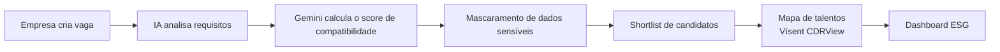
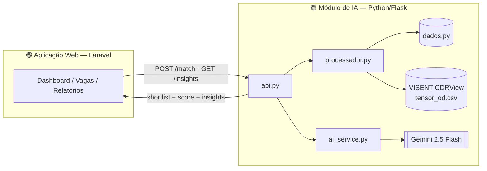

<div align="center">


### Plataforma de Matching Inclusivo (B2B)

*Conectando empresas com metas ESG a profissionais de grupos sub-representados, através de matching inteligente, métricas de diversidade e inteligência geográfica.*


<br>
<hr>

[](https://s06-26-ab-equipe-27.onrender.com/)


<hr>

</div>

<br>

## 📑 Sumário

- [O Problema](#-o-problema)
- [A Solução](#-a-solução)
- [Os 5 Serviços](#-os-5-serviços)
- [Fluxo do Usuário](#-fluxo-do-usuário)
- [Arquitetura](#️-arquitetura)
- [Módulo de IA](#-módulo-de-ia)
- [API](#-api)
- [Tecnologias Utilizadas](#-tecnologias-utilizadas)
- [Instruções de Uso](#-instruções-de-uso)
- [Estrutura do Repositório](#-estrutura-do-repositório)
- [Escopo do MVP](#-escopo-do-mvp)
- [Equipe](#-equipe-27)

<br>

## 🎯 O Problema

Empresas que possuem metas ESG enfrentam dificuldades para encontrar, atrair e contratar talentos de grupos sub-representados de forma eficiente e sem vieses. Além disso, muitas organizações não possuem:

- Dados confiáveis sobre diversidade em seus processos seletivos;
- Ferramentas para medir impacto e evolução das metas ESG;
- Visibilidade sobre onde estão os talentos disponíveis;
- Mecanismos para reduzir vieses inconscientes durante a seleção.

O **SkillFocus** busca transformar a diversidade em uma estratégia de negócio baseada em dados, impacto mensurável e oportunidades reais.

> [!NOTE]
> Diversidade não é apenas uma meta ESG: também está relacionada à inovação, criatividade e melhores resultados organizacionais.

<br>

## 💡 A Solução

A plataforma centraliza recrutamento inclusivo em um único ambiente digital, oferecendo:

-  Matching inteligente entre vagas e candidatos, via IA generativa;
-  Filtros de diversidade e mecanismos anti-viés (mascaramento de dados sensíveis);
-  Dashboard de métricas ESG;
-  Relatórios de diversidade;
-  Insights geográficos utilizando dados do dataset **Vísent CDRView**.

<br>

## 🧩 Os 5 Serviços

O SkillFocus foi projetado para oferecer cinco serviços integrados.

> [!IMPORTANT]
> O escopo desta versão abrange **exclusivamente** a funcionalidade de **Empregabilidade**. Os demais módulos permanecem previstos para futuras evoluções da plataforma.

| # | Serviço | O que faz | Status |
|---|---|---|---|
| 1 | **Formações** | Trilhas de capacitação para RH e lideranças em diversidade e inclusão | ⏳ Planejado |
| 2 | **Empregabilidade** | Publicação de vagas e matching inteligente com candidatos | ✅ Em desenvolvimento |
| 3 | **Experiências Estruturantes** | Eventos e palestras com líderes de grupos sub-representados | ⏳ Planejado |
| 4 | **Mentorias** | Conexão entre empresas e especialistas em diversidade | ⏳ Planejado |
| 5 | **Saúde do Time** | Dashboard de bem-estar baseado em dados anonimizados | ⏳ Planejado |

<br>

## 🔄 Fluxo do Usuário

1. Empresa se cadastra e configura perfil de diversidade e metas ESG;
2. Publica vaga com requisitos técnicos e filtros de diversidade;
3. O motor de IA retorna uma shortlist com **score de compatibilidade** e **badge de diversidade**;
4. Empresa visualiza o mapa de concentração de talentos por região (Vísent CDRView);
5. Seleciona candidatos e inicia o processo de contato;
6. O dashboard atualiza as métricas de diversidade em tempo real.


<br>

## 🏗️ Arquitetura

O produto é dividido em duas camadas que se comunicam via API REST: a aplicação web em **Laravel** (front-end + regras de negócio do produto) e um **microsserviço de IA em Python/Flask**, responsável pelo matching inteligente, anti-viés e análise geográfica.



<br>

## 🤖 Módulo de IA

O módulo de Inteligência Artificial, desenvolvido em **Python**, é responsável por calcular a compatibilidade entre candidatos e vagas, mascarar dados sensíveis para reduzir viés inconsciente, gerar recomendações via IA generativa, processar dados geográficos do dataset VISENT CDRView, e expor tudo isso via API REST para o front-end Laravel.

### Arquivos do módulo

| Arquivo | Responsabilidade |
|---|---|
| `processador.py` | Funções principais de matching, mascaramento de dados, NLP e geolocalização |
| `ai_service.py` | Integração com a API do Gemini (Google) para cálculo de score via IA generativa e extração de texto de PDFs |
| `api.py` | Servidor Flask — expõe os endpoints REST para integração com o Laravel |
| `dados.py` | Dados mock de candidatos e vagas para desenvolvimento e testes |
| `app.py` | Script de execução local para testes manuais do fluxo completo via terminal |
| `.env` | Variáveis de ambiente com credenciais |

### Score de Match via IA Generativa (Gemini)

O score de compatibilidade é calculado pela função `calcular_match_ia()` (`ai_service.py`), que monta um prompt estruturado com os dados da vaga (título, senioridade, skills obrigatórias e desejáveis) e do candidato (senioridade e skills), solicitando ao modelo **`gemini-2.5-flash`** um JSON com:

- `score` — número de 0 a 100 representando a compatibilidade;
- `justificativa` — texto em português explicando o raciocínio da pontuação.

Essa abordagem permite avaliações mais nuançadas que uma fórmula matemática simples, considerando contexto, senioridade e similaridade semântica entre skills.

### Mascaramento de Dados (Anti-viés)

A função `mascarar_dados()` remove automaticamente os campos sensíveis de cada candidato **antes** de qualquer dado ser retornado ao recrutador:

> [!CAUTION]
> Campos removidos: `nome`, `idade`, `raça`, `gênero`, `PCD (is_pcd)`, `município`, `latitude` e `longitude`.

O recrutador recebe apenas: cluster de origem (região), skills, senioridade, score de match, skills em comum com a vaga, badge de diversidade e justificativa da IA — reduzindo o viés inconsciente no processo seletivo.

### Badge de Diversidade

Cada candidato recebe automaticamente um badge declarativo:

- Candidatos que se identificam como **gênero feminino** ou que possuem **deficiência (PCD)** recebem `Badge: Diversidade`;
- Os demais recebem `Badge: Padrão`.

### NLP — Normalização de Skills

A função `processador_nlp()` identifica as skills em comum entre candidato e vaga usando interseção de conjuntos, normalizando tudo para letras minúsculas antes da comparação — evitando que diferenças de capitalização (ex.: `Node.js` vs `node.js`) gerem falsos negativos no matching.

### Geolocalização — Dataset VISENT CDRView

A função `processar_dados_geograficos()` carrega o dataset VISENT (`tensor_od.csv`), com dados de concentração de usuários por zona geográfica e cobertura de rede. Os dados são cruzados com os clusters de origem dos candidatos (merge/JOIN) e agrupados por região para calcular a quantidade de candidatos por cluster e a média de usuários na região. Esses dados alimentam o endpoint `/insights`, usado pelo front-end para exibir o mapa de concentração de talentos.

### Leitura de Currículo em PDF

> [!WARNING]
> **Funcionalidade planejada, ainda não integrada ao fluxo principal.** A função `extrair_texto_pdf()` já está implementada em `ai_service.py` usando `PyPDF2`, mas a integração completa ao pipeline de matching está prevista para uma próxima versão do produto.

<br>

## 📡 API

### Front-end Laravel ↔ back-end da aplicação

| Método | Endpoint | Request | Response |
|---|---|---|---|
| **POST** | `/match` | `{ empresa_id, vaga: { titulo, skills, nivel, regiao }, filtros: { anti_vies, diversidade_minima } }` | `{ candidatos: [{ candidato_id, nome, score_match, badge_diversidade, skills, lat, lng }], total_analisados, diversidade_resultado }` |
| **GET** | `/insights` | N/A | `{ mapa_talentos: [{ regiao, concentracao, cobertura_rede, perfis_disponiveis }] }` |

### Microsserviço de IA (Python/Flask)

| Método | Rota | Descrição |
|---|---|---|
| **POST** | `/match` | Recebe os dados da vaga e retorna a shortlist de candidatos com score, badge, skills em comum, justificativa da IA, total analisado e percentual de diversidade |
| **GET** | `/insights` | Retorna o mapa de talentos por região (dados geográficos do VISENT), usado pelo front-end para exibir a concentração de candidatos por cluster |


<br>

## 🛠 Tecnologias Utilizadas

**Frontend**


**Backend Web**


**Módulo de IA (Python)**


**Banco de Dados**


**Ferramentas**


-17152A?style=for-the-badge&logo=anthropic&logoColor=white)

<br>

## 🚀 Instruções de Uso

### 1. Aplicação Web (Laravel)

**Requisitos:**
- PHP
- Composer
- XAMPP (ou outro ambiente com Apache/MySQL)
- Git

```bash
# 1. Clone a branch dev
git clone -b dev https://github.com/No-Country-simulation/S06-26-AB-Equipe-27.git

# 2. Entre na pasta do projeto
cd S06-26-AB-Equipe-27

# 3. Instale as dependências
composer install

# 4. Copie o arquivo de ambiente
cp .env.example .env

# 5. Gere a chave da aplicação Laravel
php artisan key:generate

# 6. Rode as migrations
php artisan migrate

# 7. Inicie o servidor local
php artisan serve
```

### 2. Módulo de IA (Python/Flask)

```bash
# 1. Acesse a pasta do módulo de IA
cd meu-projeto-bit

# 2. Crie e ative o ambiente virtual
python -m venv .venv    # # Linux / macOS
source .venv/bin/activate   # Windows: .venv\Scripts\activate

# 3. Instale as dependências
pip install -r requirements.txt   

# 4. Configure o .env com a chave da API do Gemini
# GEMINI_API_KEY=sua_chave_aqui

# 5. Inicie o servidor Flask
python api.py  
```

<br>

## 📁 Estrutura do Repositório

```
.
├── app/
├── bootstrap/
├── config/
├── database/
├── meu-projeto-bit/
│   ├── data/
│   ├── __pycache__/
│   ├── api.py
│   ├── app.py
│   ├── dados.py
│   ├── processador.py
│   └── requirements.txt
├── public/
├── resources/
├── routes/
├── storage/
├── tests/
├── composer.json
├── package.json
└── README.md
```

<br>

## ✅ Escopo do MVP

- [x] Publicação de vaga com skills, nível e região
- [ ] Endpoint `/match` com shortlist + score de compatibilidade + badge de diversidade
- [ ] Interface responsiva com tela de shortlist
- [x] Métricas básicas de diversidade
- [x] Score de match via IA generativa (Gemini)
- [x] Mascaramento de dados sensíveis (anti-viés)
- [x] Badge de diversidade declarativo
- [x] Processamento geográfico via dataset VISENT CDRView
- [ ] Leitura de currículo em PDF integrada ao fluxo principal
- [x] README com instruções de execução local e exemplos de request/response

<br>

## 👥 Equipe 27 
— S06-26-AB-Equipe-27

| Papel | Responsável | GitHub |
|---|---|---|
| Backend Developer | Aylin Bochi | [Acesse aqui](https://github.com/aylinlbochi) |
| Backend Developer | Deméthrius Heitor Silva | [Acesse aqui](https://github.com/heitorsantanazx) |
| Full Stack Developer | Edmilson Ferreira | [Acesse aqui](https://github.com/EdmilsonFerreira) |
| Data analyst| Fernanda Marques | [Acesse aqui](https://github.com/FernandaMarques07) |
| UX Researcher | Luciana Freitag | [Acesse aqui](https://github.com/lucianafreitag) |
| Social Media Manager | Renata Guedes | [Acesse aqui](https://github.com/renataguedees) |
| Full Stack Developer | Thiago Ferreira | [Acesse aqui](https://github.com/thiagosag) |

<br>

---

<div align="center">

*Este projeto foi desenvolvido para o desafio App BiT da Wongola durante o Hackathon NoCountry.*


*Inove · Impacte · Transforme*

🖤 **Wongola / Black in Tech** — 2026

</div>
